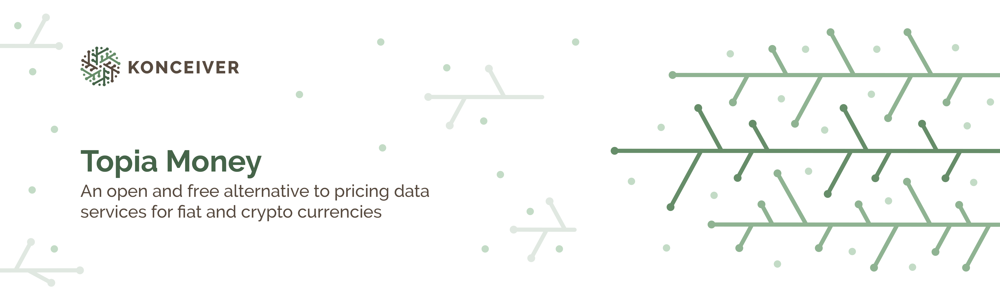

# Topia Money

This repository contains the source code of [Topia Money](https://topia.money/). It is a small [Laravel](https://laravel.com/) application that indexes historical pricing information for crypto currencies through [Topia Money Core](https://github.com/faustbrian/topia-money-core). It exposes all data in a normalised format through a REST API, ready for consumption in third-party applications.

## Adding a new Crawler or Service

If you want to add a new Crawler or Service to gather data you can submit a pull request with tests to [Topia Money Core](https://github.com/faustbrian/topia-money-core). This package is responsible for all of the data gathering and normalising.

## Roadmap

- [x] Indexing for fiat rates
- [x] Indexing for crypto rates
- [ ] Aggregate asset rates based on average/median
- [ ] Conversion between all asset rates **(Fiat/Crypto, Crypto/Fiat, Fiat/Fiat, Crypto/Crypto)**
- [x] Derive assets from known symbols
- [x] API Authentication

## Changelog

Please see [CHANGELOG](CHANGELOG.md) for more information on what has changed recently.

## Contributing

Please see [CONTRIBUTING](CONTRIBUTING.md) for details.

## Security

If you discover a security vulnerability within this package, please send an e-mail to security@konceiver.dev. All security vulnerabilities will be promptly addressed.

## Credits

This project exists thanks to all the people who [contribute](../../contributors).

## Support Us

We invest a lot of resources into creating and maintaining our packages. You can support us and the development through [GitHub Sponsors](https://github.com/sponsors/faustbrian).

## License

Topia Money is an open-sourced software licensed under the [GNU AGPLv3](LICENSE).
